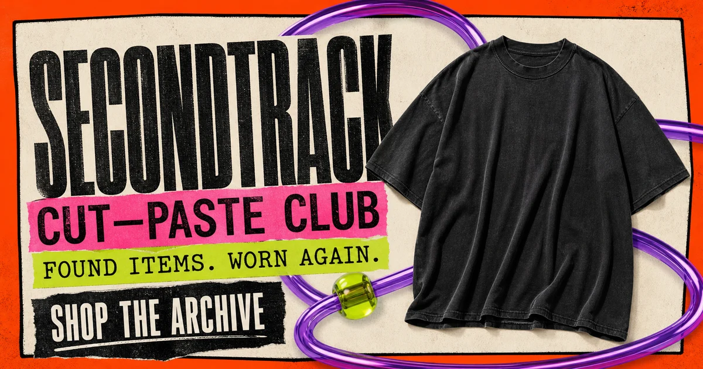
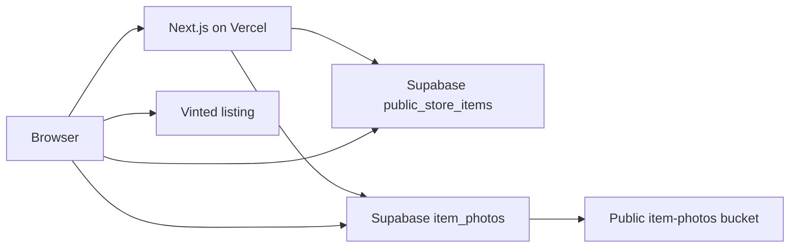

# SECONDTRACK Public Store

An editorial, server-rendered storefront for curated second-hand clothing. The site presents live inventory from Supabase, keeps favorites locally, and hands purchasing off to Vinted. It deliberately has no account system, cart, checkout, or write access to the inventory database.

**Stack:** Next.js · TypeScript · Supabase · Playwright · Vercel

[](https://github.com/Wint567/SecondTrackShop/actions/workflows/ci.yml?query=branch%3Amain)



## What this project demonstrates

- Next.js App Router with server rendering and five-minute revalidation for public inventory.
- A narrow Supabase boundary: only the public product view, public photo records, and the `item-photos` storage bucket are read with the publishable/anon key.
- Real product photography with primary-photo selection, fallback ordering, URL normalization, and per-image failure states.
- Search, shareable filters, sorting, pagination, and back/forward navigation through catalog query parameters.
- Device-local favorites with cross-tab synchronization, blocked-storage fallback, clear-all, and undo.
- Responsive product galleries with keyboard, touch, lightbox, focus management, and reduced-motion support.
- A procedural React Three Fiber backdrop with pointer interaction, visibility throttling, WebGL capability detection, and a static CSS fallback.
- Metadata, dynamic sitemap entries, structured product data, security headers, and a branded 404/error experience.
- Unit, browser, accessibility, resource, responsive, and WebGL-fallback checks in GitHub Actions.

## Architecture



The server fetches the first product payload for `/`, `/catalog`, `/new-drop`, `/brands`, `/saved`, and product routes. That makes real card content available in the initial HTML and keeps catalog errors distinct from an empty collection. Client components are limited to interactions that need browser state: catalog controls, favorites, gallery controls, retry actions, navigation overlays, and the optional WebGL scene.

No `service_role` key is used or expected. The browser receives only the same public configuration required by the Supabase client. Inventory writes, customer accounts, payments, and order data are outside this repository.

## Routes

| Route             | Purpose                                                 |
| ----------------- | ------------------------------------------------------- |
| `/`               | Editorial landing page and current drop                 |
| `/catalog`        | Searchable and filterable public archive                |
| `/new-drop`       | Latest published objects                                |
| `/brands`         | Brand index built from live inventory                   |
| `/product/[slug]` | Product gallery, details, favorites, and Vinted handoff |
| `/saved`          | Favorites stored on the current device                  |
| `/about`          | SECONDTRACK approach and sourcing principles            |

## Local development

Requirements: Node.js 22 and npm 10.

```bash
npm ci
cp .env.example .env.local
npm run dev
```

Set these variables in `.env.local`:

```dotenv
NEXT_PUBLIC_SUPABASE_URL=
NEXT_PUBLIC_SUPABASE_ANON_KEY=
NEXT_PUBLIC_SITE_URL=http://localhost:3000
```

The Supabase variables must describe a public client. Keep admin credentials and `service_role` keys out of this project. If configuration is missing or a public read fails, the storefront renders an explicit error state and never substitutes sample products.

## Quality checks

```bash
npm run format:check
npm run lint
npm run typecheck
npm run test:unit
npm run build:verified
npm run verify:prerender
npm run test:e2e
npm audit --omit=dev
```

`npm run build:verified` creates the production build and enforces a gzip budget for individual client chunks. Vercel uses the conventional `npm run build` command, while CI runs the verified variant. The browser suite covers server HTML, URL-state behavior, favorites, product routes, local resources, accessibility, layouts from 320 to 1600 px, reduced motion, WebGL fallback, and pointer-driven canvas updates.

Install the Playwright browsers once before the first local browser run:

```bash
npx playwright install
```

## Deploying to Vercel

1. Import the GitHub repository into Vercel and keep the detected framework preset as **Next.js**.
2. Add `NEXT_PUBLIC_SUPABASE_URL` and `NEXT_PUBLIC_SUPABASE_ANON_KEY` to Preview and Production.
3. Set `NEXT_PUBLIC_SITE_URL` to the canonical production origin. When it is omitted, the server falls back to Vercel's production/project URL variables.
4. Deploy a Preview and complete the staging checklist in [`docs/DEPLOYMENT.md`](docs/DEPLOYMENT.md).

The project needs no custom build command, output directory, server adapter, or edge-worker configuration.

## Engineering decisions

- Product data remains server-first for discoverability and resilient initial rendering; the client reuses that payload instead of immediately fetching it again.
- Favorites remain local because the public shop has no identity layer. This avoids pretending to provide cross-device persistence.
- Vinted remains the purchase boundary. External URLs are restricted to secure `vinted.pl` hosts before a purchase link is rendered.
- The animated backdrop is progressive enhancement. Reduced-motion users, background tabs, off-screen sections, unsupported WebGL contexts, and rendering failures receive a stable fallback.
- The catalog stores user-visible state in the URL so search results can be shared and browser history remains useful.

## Repository policy

Generated output, local environment files, browser reports, and preview caches are ignored. Product photos are never checked into this repository; live images are served from Supabase. Visual assets under `public/` are limited to the favicon and social preview used by the current storefront.

Copyright © SECONDTRACK. All rights reserved. See [`LICENSE`](LICENSE).
